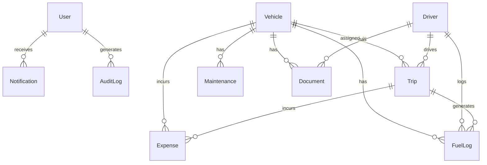

# TransitOps — Smart Transport Operations Platform

A hackathon-winning, enterprise-grade SaaS Transport Operations Platform with AI features, premium UI, full RBAC, and production-ready architecture.

## User Review Required

> [!IMPORTANT]
> **Node.js is not installed** on your machine. We need to install Node.js (v20 LTS or v22) before proceeding. I'll install it via `winget` as the first step.

> [!IMPORTANT]
> **PostgreSQL**: You have MySQL installed. We need PostgreSQL for the Prisma + PostgreSQL stack. Do you have PostgreSQL installed, or should we use a Docker PostgreSQL container? Alternatively, we could use **SQLite** for local development (Prisma supports it) and PostgreSQL for production.

> [!WARNING]
> **Scope Management**: This is a very large project. I'll build it in phases to ensure each phase works fully before moving on. The plan below covers ALL modules, but execution will be phased.

> [!IMPORTANT]
> **GitHub Push**: The repo `https://github.com/aditya-cs23b1087/odoo26.git` — I'll need push credentials configured. Make sure you have git credentials set up (GitHub CLI, SSH key, or credential manager).

## Open Questions

1. **Database**: Should I use SQLite for local dev (simpler setup, no Docker needed) or set up PostgreSQL via Docker?
2. **Node.js Installation**: Shall I install Node.js v22 LTS via winget?
3. **Authentication**: Should we use real JWT auth with bcrypt password hashing, or a simulated auth for the hackathon demo?
4. **AI Features**: Should AI predictions use algorithmic heuristics (no external API needed) or integrate with an LLM API (OpenAI/Gemini)?

---

## Architecture Overview

```
transitops/
├── frontend/                    # Next.js 15 App
│   ├── src/
│   │   ├── app/                 # App Router (pages & layouts)
│   │   │   ├── (auth)/          # Auth pages (login, forgot-password)
│   │   │   ├── (dashboard)/     # Protected dashboard layout
│   │   │   │   ├── dashboard/   # Main dashboard
│   │   │   │   ├── vehicles/    # Vehicle management
│   │   │   │   ├── drivers/     # Driver management
│   │   │   │   ├── trips/       # Trip management
│   │   │   │   ├── maintenance/ # Maintenance module
│   │   │   │   ├── fuel/        # Fuel management
│   │   │   │   ├── expenses/    # Expense management
│   │   │   │   ├── reports/     # Reports & analytics
│   │   │   │   ├── alerts/      # Notification center
│   │   │   │   └── settings/    # Settings & profile
│   │   │   ├── layout.tsx       # Root layout
│   │   │   └── page.tsx         # Landing/redirect
│   │   ├── components/          # Reusable UI components
│   │   │   ├── ui/              # Shadcn UI primitives
│   │   │   ├── layout/          # Sidebar, Header, etc.
│   │   │   ├── dashboard/       # Dashboard-specific components
│   │   │   ├── charts/          # Chart components
│   │   │   ├── forms/           # Form components
│   │   │   └── shared/          # Global shared components
│   │   ├── hooks/               # Custom React hooks
│   │   ├── lib/                 # Utilities, API client, constants
│   │   ├── stores/              # Zustand state management
│   │   ├── types/               # TypeScript type definitions
│   │   └── styles/              # Global CSS
│   ├── public/                  # Static assets
│   ├── tailwind.config.ts
│   ├── next.config.ts
│   └── package.json
│
├── backend/                     # Express.js API Server
│   ├── src/
│   │   ├── routes/              # API route handlers
│   │   ├── controllers/         # Business logic controllers
│   │   ├── middleware/          # Auth, validation, error handling
│   │   ├── services/           # Business logic services
│   │   ├── utils/              # Helpers, AI algorithms
│   │   └── index.ts            # Express app entry
│   ├── prisma/
│   │   ├── schema.prisma       # Database schema
│   │   ├── seed.ts             # Seed data
│   │   └── migrations/         # DB migrations
│   ├── package.json
│   └── tsconfig.json
│
├── docker-compose.yml           # PostgreSQL + app services
├── .env.example
├── .gitignore
└── README.md
```

---

## Proposed Changes

### Phase 1: Project Setup & Infrastructure

#### [NEW] Root Configuration
- `.gitignore` — Comprehensive gitignore for Node.js, Next.js, Prisma
- `docker-compose.yml` — PostgreSQL database service
- `.env.example` — Environment variable template
- `README.md` — Project documentation with setup instructions

---

#### [NEW] Backend - Express + Prisma

##### `backend/prisma/schema.prisma`
Complete relational schema with these models:
- **User** — id, email, name, password, role, avatar, createdAt, updatedAt
- **Vehicle** — id, registrationNumber (unique), model, manufacturer, type, capacity, currentOdometer, acquisitionCost, acquisitionDate, currentStatus (Active/InShop/Retired/Available), insuranceExpiry, fitnessExpiry, rcExpiry, pollutionExpiry, imageUrl, qrCode, createdAt, updatedAt
- **Driver** — id, name, phone, emergencyContact, photo, licenseNumber (unique), licenseCategory, licenseExpiry, medicalCertExpiry, safetyScore, performanceRating, currentStatus (Available/OnTrip/OnLeave/Suspended), createdAt, updatedAt
- **Trip** — id, vehicleId, driverId, pickup, destination, cargoWeight, cargoType, estimatedDistance, estimatedFuel, estimatedCost, actualDistance, actualFuel, actualCost, status (Draft/Dispatched/InProgress/Completed/Cancelled), gpsLat, gpsLng, startedAt, completedAt, createdAt, updatedAt
- **FuelLog** — id, vehicleId, driverId, tripId, date, quantity, costPerUnit, totalCost, odometer, fuelType, station, createdAt
- **Maintenance** — id, vehicleId, type (Preventive/Corrective), description, scheduledDate, completedDate, garageName, cost, partsReplaced, invoiceUrl, status (Scheduled/InProgress/Completed), createdAt, updatedAt
- **Expense** — id, category (Fuel/Maintenance/Tolls/DriverSalary/Insurance/Misc), amount, description, vehicleId, driverId, tripId, date, receiptUrl, createdAt
- **Document** — id, entityType, entityId, name, type, url, expiryDate, createdAt
- **Notification** — id, userId, title, message, type, read, createdAt
- **AuditLog** — id, userId, action, entityType, entityId, details, ipAddress, createdAt

##### `backend/src/index.ts`
Express server with:
- CORS configuration
- JSON body parsing
- Rate limiting
- Helmet security headers
- API route mounting
- Error handling middleware

##### `backend/src/middleware/auth.ts`
- JWT token verification
- Role-based access control middleware
- `requireRole(...)` guard function

##### `backend/src/routes/` (one file per entity)
- `auth.routes.ts` — login, register, forgot-password, me
- `vehicles.routes.ts` — CRUD + status changes + document management
- `drivers.routes.ts` — CRUD + status + performance
- `trips.routes.ts` — CRUD + dispatch + complete + cancel + timeline
- `maintenance.routes.ts` — CRUD + schedule + complete
- `fuel.routes.ts` — CRUD + analytics
- `expenses.routes.ts` — CRUD + reports
- `reports.routes.ts` — Generate CSV/PDF/Excel
- `dashboard.routes.ts` — Aggregated stats + charts data
- `notifications.routes.ts` — List + mark read
- `ai.routes.ts` — AI predictions, recommendations

##### `backend/src/controllers/` & `backend/src/services/`
Business logic implementing ALL business rules:
- Registration number uniqueness
- No duplicate license numbers
- Vehicle In Shop / Retired cannot be assigned
- Expired/suspended license cannot drive
- Already assigned vehicle/driver cannot be reused
- Cargo cannot exceed capacity
- Automatic status changes on dispatch/complete/cancel/maintenance

##### `backend/prisma/seed.ts`
Realistic seed data with:
- 4 users (one per role)
- 20+ vehicles with varied statuses
- 15+ drivers with varied statuses
- 50+ trips (mix of statuses)
- Fuel logs, maintenance records, expenses
- Notifications and audit logs

---

### Phase 2: Frontend — Next.js 15 App

#### [NEW] `frontend/` — Next.js 15 with App Router

##### Core Setup
- `next.config.ts` — API proxy, image domains
- `tailwind.config.ts` — Custom TransitOps design system with:
  - Premium color palette (indigo/violet/emerald/amber)
  - Glassmorphism utilities
  - Custom animations
  - Dark mode configuration
- `src/styles/globals.css` — Base styles, Shadcn CSS variables, custom utilities

##### Shadcn UI Components (`src/components/ui/`)
Install and configure these Shadcn components:
- Button, Input, Select, Textarea, Checkbox, Switch
- Dialog, Sheet, Dropdown Menu, Command (for Ctrl+K)
- Table, Tabs, Badge, Avatar, Tooltip
- Card, Skeleton, Toast, Alert, Calendar
- Form (with React Hook Form + Zod)
- Popover, Separator, ScrollArea

##### Layout Components (`src/components/layout/`)
- **Sidebar** — Collapsible sidebar with:
  - Logo & brand
  - Navigation groups (Fleet, Operations, Finance, Reports)
  - Role-based menu filtering
  - Active state indicators
  - Collapse/expand animation
  - User profile at bottom
- **Header** — Top bar with:
  - Search bar (global search trigger)
  - Notifications bell with badge
  - Theme toggle (dark/light)
  - User avatar & dropdown
- **CommandPalette** — Ctrl+K command palette with:
  - Fuzzy search across all entities
  - Quick actions (create vehicle, trip, etc.)
  - Recent items
  - Keyboard navigation

##### Auth Pages (`src/app/(auth)/`)
- **Login** — Email + password with validation, role indicator, animated background
- **Forgot Password** — Email form with success state

##### Dashboard (`src/app/(dashboard)/dashboard/`)
Role-specific dashboards with:
- **Fleet Manager**: All KPIs, fleet overview, vehicle health
- **Dispatcher**: Active trips, pending dispatches, driver availability
- **Safety Officer**: Safety scores, incident alerts, compliance
- **Financial Analyst**: Revenue, expenses, ROI, cost trends

Dashboard components:
- **StatCards** — Animated counter cards with icons, trends, sparklines
- **FleetUtilization** — Donut/pie chart
- **TripTimeline** — Vertical timeline of recent activities
- **VehicleStatusMap** — Status distribution heatmap
- **RevenueChart** — Area chart with monthly revenue
- **ExpenseBreakdown** — Stacked bar chart
- **UpcomingAlerts** — License/maintenance expiry cards
- **DriverLeaderboard** — Ranked list with scores
- **AI Fleet Health** — Overall health score with gauge

##### Vehicle Management (`src/app/(dashboard)/vehicles/`)
- **List View** — TanStack Table with:
  - Search, sort, filter by status/type/manufacturer
  - Pagination
  - Bulk actions
  - Status badges with colors
- **Detail View** — Vehicle profile with:
  - Image gallery
  - Document viewer (insurance, RC, fitness, pollution)
  - Maintenance history timeline
  - Trip history
  - Fuel efficiency chart
  - QR code display
  - AI health score meter
- **Create/Edit Form** — Multi-step form with:
  - Zod validation
  - Image upload
  - Document upload
  - Success/error toasts

##### Driver Management (`src/app/(dashboard)/drivers/`)
- Similar CRUD with list + detail + form
- Safety score gauge
- Performance rating stars
- Driving history timeline
- Achievement badges
- License expiry warnings

##### Trip Management (`src/app/(dashboard)/trips/`)
- Trip list with status filters
- Create trip form with:
  - Vehicle selector (filtered by availability)
  - Driver selector (filtered by availability)
  - Capacity validation
  - Cost estimation
  - AI route recommendation
- Trip detail with:
  - Status timeline
  - GPS tracking simulation (animated map placeholder)
  - Cargo details
  - Cost breakdown
- Smart dispatch: AI-recommended vehicle + driver

##### Maintenance (`src/app/(dashboard)/maintenance/`)
- Calendar view (interactive)
- List view with filters
- Schedule form
- AI maintenance prediction
- Service history

##### Fuel Management (`src/app/(dashboard)/fuel/`)
- Fuel log list
- Add fuel log form
- Efficiency trends chart
- Consumption analytics
- AI fuel prediction

##### Expense Management (`src/app/(dashboard)/expenses/`)
- Expense list with category filters
- Add expense form
- Monthly breakdown charts
- Auto-generated reports

##### Reports (`src/app/(dashboard)/reports/`)
- Report type selector
- Date range picker
- Interactive charts
- Export buttons (CSV, PDF, Excel)
- Vehicle ROI calculator
- Fleet utilization report
- Driver performance report

---

### Phase 3: AI Features & Bonus

#### AI Engine (`backend/src/utils/ai/`)
All AI features use **algorithmic heuristics** (no external API dependency):

- **Fleet Health Score** — Weighted calculation based on: vehicle age, maintenance history, mileage, document status, recent breakdowns
- **Maintenance Prediction** — Based on mileage intervals, time since last service, vehicle age, historical patterns
- **Fuel Consumption Prediction** — Linear regression on historical fuel data per vehicle
- **Smart Dispatch** — Score vehicles/drivers based on: proximity, fuel efficiency, driver rating, vehicle health, cargo compatibility
- **Best Driver Recommendation** — Composite score from: safety score, performance rating, trip success rate, fuel efficiency
- **Risk Detection** — Flag: expiring documents, overdue maintenance, low safety scores, high fuel consumption anomalies

#### Bonus Frontend Features
- **Command Palette** (Ctrl+K) — Global search & quick actions
- **Notification Center** — Bell icon with dropdown, mark as read
- **Alerts Center** — Document expiry, maintenance due, risk alerts
- **Driver Leaderboard** — Gamified ranking with badges
- **Achievement Badges** — Trip milestones, safety streaks, fuel efficiency
- **Activity Timeline** — Audit log viewer
- **Bulk CSV Upload** — For vehicles and drivers
- **Skeleton Loaders** — On every data-fetching component
- **Toast Notifications** — Success/error/warning for every action
- **Confirmation Dialogs** — Before destructive actions
- **Empty States** — Beautiful illustrations for no-data states

---

## Design System

### Color Palette
```
Primary:     #6366f1 (Indigo 500)    — Main brand
Secondary:   #8b5cf6 (Violet 500)    — Accents
Success:     #10b981 (Emerald 500)   — Available, Completed
Warning:     #f59e0b (Amber 500)     — Pending, Due Soon
Danger:      #ef4444 (Red 500)       — Cancelled, Expired
Info:        #3b82f6 (Blue 500)      — In Progress

Dark BG:     #0f0f23                  — Dashboard background
Dark Card:   #1a1a3e                  — Card surfaces
Dark Border: #2a2a5a                  — Subtle borders

Light BG:    #f8fafc                  — Dashboard background
Light Card:  #ffffff                  — Card surfaces
```

### Typography
- **Font**: Inter (Google Fonts) — clean, modern, professional
- **Headings**: Semi-bold, tight tracking
- **Body**: Regular, relaxed line height
- **Mono**: JetBrains Mono for data/stats

### Animations (Framer Motion)
- Page transitions: fade + slide
- Card hover: subtle lift + shadow
- Counter animations: count-up on dashboard stats
- Sidebar: smooth collapse/expand
- Modals: scale + fade
- Charts: draw-in animations

---

## Database Schema (ERD)



---

## Execution Phases

### Phase 1 (Foundation) — ~2 hours
1. Install Node.js
2. Create Next.js 15 frontend project
3. Create Express backend project
4. Set up Prisma with schema
5. Set up Tailwind + Shadcn UI
6. Create base layout (sidebar, header)
7. Auth pages (login, forgot password)

### Phase 2 (Core Modules) — ~3 hours
1. Backend API routes for all entities
2. Seed database with realistic data
3. Dashboard with all KPI cards + charts
4. Vehicle CRUD with full validation
5. Driver CRUD with full validation
6. Trip management with business rules

### Phase 3 (Advanced Modules) — ~2 hours
1. Maintenance module with calendar
2. Fuel management with analytics
3. Expense management with reports
4. Reports module with export

### Phase 4 (AI & Bonus) — ~1.5 hours
1. AI health score, predictions, recommendations
2. Command palette (Ctrl+K)
3. Notification center
4. Driver leaderboard & badges
5. Audit logs & activity timeline
6. Bulk CSV upload

### Phase 5 (Polish & Deploy) — ~1 hour
1. Dark/light mode polish
2. Animation refinement
3. Empty states
4. Error handling
5. Git push to GitHub
6. README documentation

---

## Verification Plan

### Automated Tests
```bash
# Backend
cd backend && npm run test

# Frontend build verification
cd frontend && npm run build

# Prisma schema validation
cd backend && npx prisma validate

# TypeScript type checking
cd frontend && npx tsc --noEmit
```

### Manual Verification
- Login with each role and verify different dashboard views
- Create, edit, delete vehicles/drivers/trips
- Verify all business rules are enforced
- Test dark/light mode toggle
- Test responsive design at different breakpoints
- Verify all charts render correctly
- Test Command Palette (Ctrl+K)
- Export reports in CSV/PDF/Excel
- Verify toast notifications on all actions
